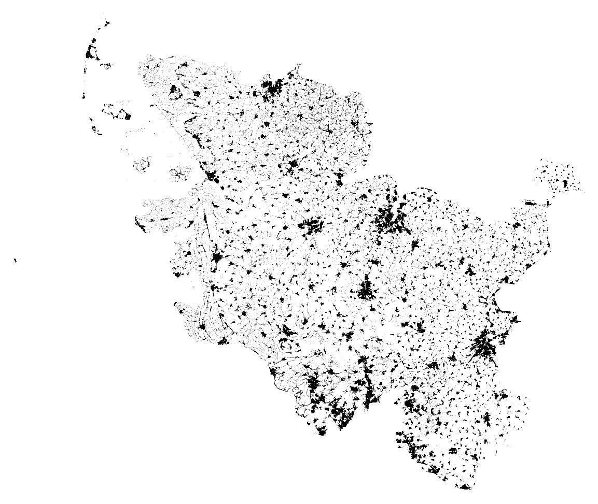

# sh-addresses

Amtliche Adressen für Schleswig-Holstein [pro Postleitzahl im CSV-Format](data), heruntergeladen aus dem INSPIRE WFS-Downloaddienst des Landesamtes für Vermessung und Geoinformation Schleswig-Holstein. Die Daten stehen unter der CC-BY-4.0-Lizenz (© GeoBasis-DE/LVermGeo SH/CC BY 4.0).

Der [Harvester](harvester) ist in Python geschrieben. Er teilt die Queries so auf, dass die Obergrenze an Ergebnissen pro Query eingehalten wird, wie vom WFS-Dienst vorgegeben. Die Ergebnisse werden erst in einer SQLite-Datenbank zwischengespeichert und anschließend in mehrere CSV-Dateien geschrieben.

Die Adressen sind georeferenziert im Koordinatenreferenzsystem EPSG:4326 und lassen sich so auf einer Karte darstellen:



## Installation

```
git clone https://github.com/hriebl/sh-addresses
cd sh-addresses
python -m venv venv
source venv/bin/activate
pip install -r requirements.txt
```

## Harvesting

```
rm -rf data
mkdir data
python -m harvester data
```
